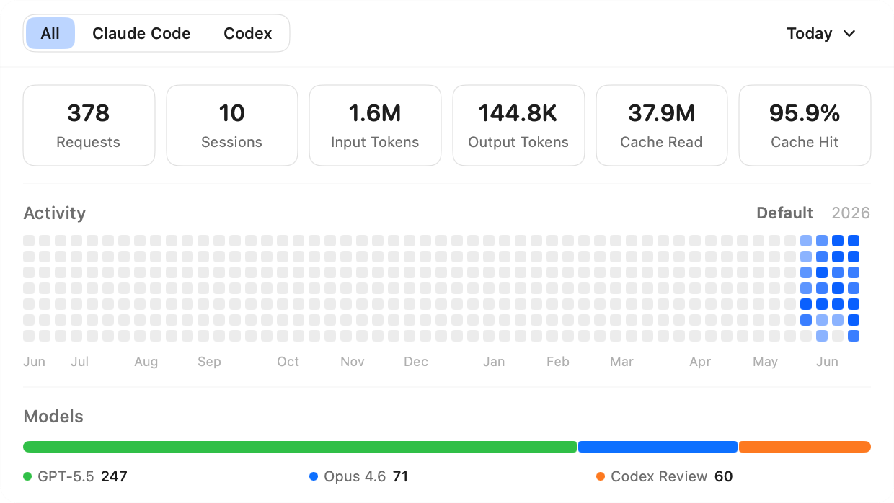

<p align="center">
  
</p>

<h1 align="center">Monitor Agent</h1>

<p align="center">
  A lightweight macOS menu bar app that tracks your AI coding assistant usage.<br>
  Supports <strong>Claude Code</strong> and <strong>Codex</strong>.
</p>

<p align="center">
  <a href="#features">Features</a> •
  <a href="#screenshot">Screenshot</a> •
  <a href="#installation">Installation</a> •
  <a href="#settings">Settings</a> •
  <a href="#how-it-works">How It Works</a> •
  <a href="#中文说明">中文说明</a>
</p>

---

## Features

- **Menu bar native** — lives in your menu bar, one click to view stats
- **Zero configuration** — automatically reads local session logs, no API keys needed
- **Filter by app** — switch between All / Claude Code / Codex
- **Time range** — Today, 7 Days, 30 Days, All Time, or a custom calendar selection
- **Stats at a glance** — Requests, Sessions, Input Tokens, Output Tokens, Cache Read, Cache Hit Rate
- **Activity heatmap** — trailing-365-day default view, per-year view, hover tooltips, and click-to-filter days
- **Hourly token drill-down** — click an active Activity day to inspect Input Tokens, Output Tokens, and Cache Read by hour
- **Model distribution** — stacked bar showing usage across the top models
- **Settings editor** — update app preferences, Claude Code / Codex config files, and prompt files from one window
- **Local data rebuild** — rebuild Monitor Agent's derived usage database from source logs without changing original logs or settings
- **Auto-update** — built-in update checker with one-click download and install

## Screenshot



## Installation

### Download

Download the latest `MonitorAgent.zip` from [Releases](https://github.com/hd1987/monitor-agent-app/releases), unzip, and drag to `/Applications`.

> **First launch:** Since the app is not notarized, macOS will show a warning. Go to **System Settings → Privacy & Security**, scroll to the bottom, and click **Open Anyway**.

### Build from source

```bash
git clone https://github.com/hd1987/monitor-agent-app.git
cd monitor-agent-app
swift build -c release
```

### Run locally

```bash
swift run MonitorAgent &
pkill -f MonitorAgent
```

## Settings

Open settings from the right-click menu or `Cmd+,`.

| Page | What it controls |
|------|------------------|
| General | Theme, sync interval (`10s`, `30s`, `60s`, `Never`), Keep in Background, Launch at Login, local usage data rebuild |
| Config | `~/.claude/settings.json` and `~/.codex/config.toml` |
| Prompt | `~/.claude/CLAUDE.md` and `~/.codex/AGENTS.md` |

Saving asks for confirmation, applies only the current page, keeps the window open, and shows a success toast.

## How It Works

Monitor Agent reads the JSONL session logs that Claude Code and Codex write locally:

| Source | Path |
|--------|------|
| Claude Code | `~/.claude/projects/**/*.jsonl` |
| Codex | `~/.codex/sessions/**/rollout-*.jsonl` and `~/.codex/archived_sessions/rollout-*.jsonl` |

All data stays on your machine. Nothing is sent anywhere. The app stores parsed results in `~/.monitor-agent/monitor.db` and syncs incrementally based on the selected sync interval. Opening the panel always triggers an on-demand sync.

`monitor.db` is a derived local cache. The General settings page can rebuild it by syncing all source logs into `~/.monitor-agent/monitor-rebuild.tmp.db`, validating the temporary database, and replacing `monitor.db` only after the rebuild succeeds. The rebuild dialog shows file-level progress and the final requests/sessions/files summary. Original Claude Code and Codex logs, settings, and prompt files are not changed.

## Requirements

- macOS 14.0+
- Claude Code and/or Codex installed locally

## License

MIT

---

## 中文说明

<p align="center">
  一款轻量的 macOS 菜单栏应用，追踪你的 AI 编程助手使用情况。<br>
  支持 <strong>Claude Code</strong> 和 <strong>Codex</strong>。
</p>

### 功能

- **菜单栏常驻** — 点击图标即可查看统计
- **零配置** — 自动读取本地会话日志，无需 API Key
- **按工具筛选** — All / Claude Code / Codex 一键切换
- **时间范围** — 今日、7 天、30 天、全部，或日历自定义范围
- **核心指标** — 请求数、会话数、输入 Token、输出 Token、缓存读取、缓存命中率
- **活动热力图** — 默认展示最近 365 天，也可切换年份；悬停显示详情，点击有数据日期可筛选
- **小时级 Token 图表** — 点击 Activity 中有数据的日期，查看输入、输出、缓存读取的小时分布
- **模型分布** — 堆叠比例条展示各模型使用占比
- **设置编辑器** — 在同一个窗口管理应用设置、Claude Code / Codex 配置和提示词文件
- **本地数据重建** — 从源日志重建 Monitor Agent 的派生使用数据库，不修改原始日志或设置
- **自动更新** — 内置更新检查，一键下载安装

### 安装

从 [Releases](https://github.com/hd1987/monitor-agent-app/releases) 下载最新的 `MonitorAgent.zip`，解压后拖入 `/Applications` 即可。

> **首次启动：** 应用未经公证，macOS 会弹出警告。打开 **系统设置 → 隐私与安全性**，滚到底部，点击 **仍要打开** 即可。

### 设置

通过右键菜单或 `Cmd+,` 打开设置。

| 页面 | 内容 |
|------|------|
| General | 主题、同步间隔（`10s`、`30s`、`60s`、`Never`）、后台保留、登录启动、本地使用数据重建 |
| Config | `~/.claude/settings.json` 和 `~/.codex/config.toml` |
| Prompt | `~/.claude/CLAUDE.md` 和 `~/.codex/AGENTS.md` |

保存前会二次确认，只应用当前页面，保存后窗口保持打开并显示成功提示。

### 工作原理

Monitor Agent 读取 Claude Code 和 Codex 在本地生成的 JSONL 会话日志：

| 来源 | 路径 |
|------|------|
| Claude Code | `~/.claude/projects/**/*.jsonl` |
| Codex | `~/.codex/sessions/**/rollout-*.jsonl` 和 `~/.codex/archived_sessions/rollout-*.jsonl` |

所有数据保留在本地，不会上传。解析结果存储在 `~/.monitor-agent/monitor.db`，按照设置的同步间隔增量同步；打开面板时始终会触发一次同步。

`monitor.db` 是派生本地缓存。General 设置页可以把所有源日志同步到 `~/.monitor-agent/monitor-rebuild.tmp.db`，校验临时数据库后再替换 `monitor.db`。重建弹窗会显示文件级进度，以及最终请求数、会话数和文件数汇总。Claude Code 和 Codex 的原始日志、设置和提示词文件不会被修改。

### 系统要求

- macOS 14.0+
- 本地已安装 Claude Code 和/或 Codex
