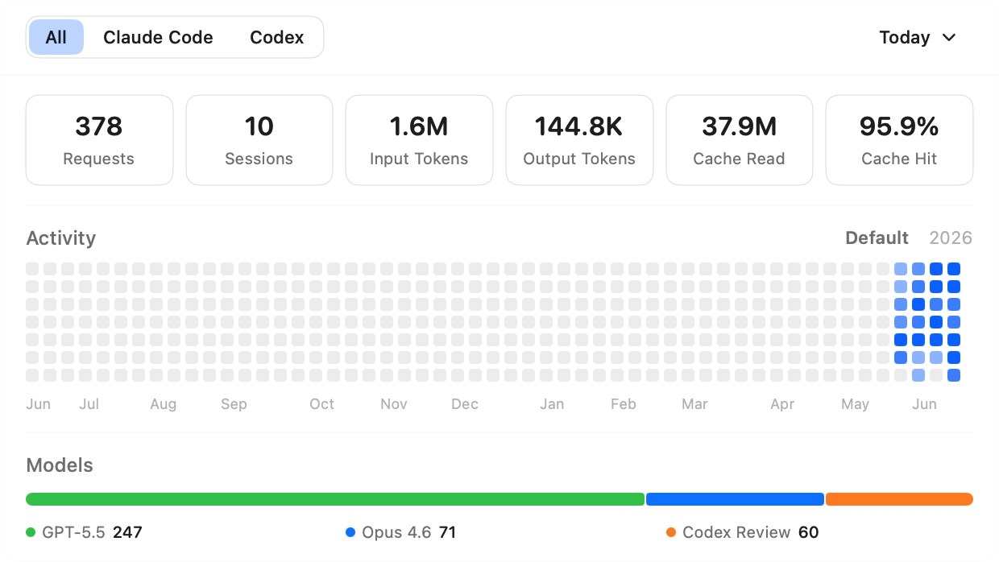

<p align="center">
  
</p>

<h1 align="center">Monitor Agent</h1>

<p align="center">
  A lightweight macOS menu bar app that tracks your AI coding assistant usage.<br>
  Supports <strong>Claude Code</strong>, <strong>Codex</strong>, and <strong>Cursor</strong>.
</p>

<p align="center">
  <a href="#features">Features</a> •
  <a href="#screenshot">Screenshot</a> •
  <a href="#installation">Installation</a> •
  <a href="#settings">Settings</a> •
  <a href="#how-it-works">How It Works</a> •
  <a href="#中文说明">中文说明</a>
</p>

---

## Features

- **Menu bar native** — lives in your menu bar, one click to view stats
- **Zero configuration** — automatically reads supported local data sources, no API keys needed
- **Filter by app** — switch between All / Claude Code / Codex / Cursor
- **Time range** — Today, 7 Days, 30 Days, All Time, or a custom calendar selection
- **Stats at a glance** — Requests, Sessions, Input Tokens, Output Tokens, Cache Read, Cache Hit Rate
- **Activity heatmap** — trailing-365-day default view, per-year view, hover tooltips, and click-to-filter days
- **Hourly token drill-down** — click any Activity day to inspect requests, Input Tokens, Output Tokens, Cache Read, and Cache Creation by hour
- **Model distribution** — stacked bar showing usage across the top models
- **Settings editor** — update app preferences, Claude Code / Codex config files, and prompt files from one window
- **MCP & Skill inventory** — inspect MCP servers and Skills for Claude Code, Codex, Cursor, and Global sources
- **Local data rebuild** — rebuild Monitor Agent's derived usage database from source logs without changing original logs or settings
- **Auto-update** — built-in update checker with release notes, download progress, and one-click install

## Screenshot



## Installation

### Download

Download the latest `MonitorAgent.zip` from [Releases](https://github.com/hd1987/monitor-agent-app/releases), unzip, and drag to `/Applications`.

> **First launch:** Since the app is not notarized, macOS will show a warning. Go to **System Settings → Privacy & Security**, scroll to the bottom, and click **Open Anyway**.

### Build from source

```bash
git clone https://github.com/hd1987/monitor-agent-app.git
cd monitor-agent-app
swift build -c release
```

### Run locally

```bash
swift run MonitorAgent &
pkill -f MonitorAgent
```

## Settings

Open settings from the right-click menu or `Cmd+,`.

| Page | What it controls |
|------|------------------|
| General | Theme, Launch at Login, subscription quota visibility, unified usage and quota refresh interval (`1 min`, `2 min`, `5 min`, `Never`), local usage data rebuild |
| Shortcuts | Global panel shortcut and customizable in-panel shortcuts |
| Config | `~/.claude/settings.json` and `~/.codex/config.toml` |
| Prompt | `~/.claude/CLAUDE.md` and `~/.codex/AGENTS.md` |
| MCP & Skill | Read-only configured MCP server states and Skill names for Claude Code, Codex, Cursor, and Global; Global reads `~/.agents/skills`, Cursor separates `~/.cursor/skills` User Skills from `~/.cursor/skills-cursor` Built-in Skills, and MCP Servers appear before Skills |

Saving an editable page asks for confirmation, applies only the current page, keeps the window open, and shows a success toast. MCP & Skill is read-only and can be refreshed from disk.

## How It Works

Monitor Agent reads Claude Code and Codex JSONL session logs plus the signed-in Cursor user's usage API:

| Source | Path |
|--------|------|
| Claude Code | `~/.claude/projects/**/*.jsonl` |
| Codex | `~/.codex/sessions/**/rollout-*.jsonl` and `~/.codex/archived_sessions/rollout-*.jsonl` |
| Cursor | `https://api2.cursor.sh/aiserver.v1.DashboardService/*` using Cursor's local signed-in session |

Claude Code and Codex logs stay on your machine. Cursor credentials are read locally for each refresh, sent only to `https://api2.cursor.sh`, and never persisted or logged by Monitor Agent. Installed apps store derived results in `~/.monitor-agent/monitor.db`; bare development executables use `~/.monitor-agent/development/monitor.db`.

Usage data and subscription quota share one non-overlapping refresh cycle while the panel is open. Opening the panel refreshes only when the selected interval has elapsed; closing it stops the timer. `Never` disables repeating refreshes and uses a 1-minute effective interval for the panel-open check. The top app filter only changes the displayed data and quota cards.

`monitor.db` is a derived local cache. The General settings page rebuilds it through `monitor-rebuild.tmp.db` in the active production or development directory, validates the temporary database, and replaces the active cache only after every source succeeds. The rebuild dialog shows progress and the final requests/sessions/files summary. Original logs, settings, and prompt files are not changed.

## Requirements

- macOS 14.0+
- Claude Code, Codex, and/or a signed-in Cursor installation

## License

MIT

---

## 中文说明

<p align="center">
  一款轻量的 macOS 菜单栏应用，追踪你的 AI 编程助手使用情况。<br>
  支持 <strong>Claude Code</strong>、<strong>Codex</strong> 和 <strong>Cursor</strong>。
</p>

### 功能

- **菜单栏常驻** — 点击图标即可查看统计
- **零配置** — 自动读取受支持的本地数据源，无需 API Key
- **按工具筛选** — All / Claude Code / Codex / Cursor 一键切换
- **时间范围** — 今日、7 天、30 天、全部，或日历自定义范围
- **核心指标** — 请求数、会话数、输入 Token、输出 Token、缓存读取、缓存命中率
- **活动热力图** — 默认展示最近 365 天，也可切换年份；悬停显示详情，点击有数据日期可筛选
- **小时级 Token 图表** — 点击 Activity 中任意日期，查看请求数、输入、输出、缓存读取和缓存创建的小时分布
- **模型分布** — 堆叠比例条展示各模型使用占比
- **设置编辑器** — 在同一个窗口管理应用设置、Claude Code / Codex 配置和提示词文件
- **MCP & Skill 清单** — 查看 Claude Code、Codex、Cursor 和 Global 来源的 MCP Servers 与 Skills
- **本地数据重建** — 从源日志重建 Monitor Agent 的派生使用数据库，不修改原始日志或设置
- **自动更新** — 内置更新检查，显示发布说明、下载进度，并支持一键下载安装

### 安装

从 [Releases](https://github.com/hd1987/monitor-agent-app/releases) 下载最新的 `MonitorAgent.zip`，解压后拖入 `/Applications` 即可。

> **首次启动：** 应用未经公证，macOS 会弹出警告。打开 **系统设置 → 隐私与安全性**，滚到底部，点击 **仍要打开** 即可。

### 设置

通过右键菜单或 `Cmd+,` 打开设置。

| 页面 | 内容 |
|------|------|
| General | 主题、登录启动、订阅额度显示、统一的用量与额度刷新间隔（`1 min`、`2 min`、`5 min`、`Never`）、本地使用数据重建 |
| Shortcuts | 全局面板快捷键和可自定义的面板内快捷键 |
| Config | `~/.claude/settings.json` 和 `~/.codex/config.toml` |
| Prompt | `~/.claude/CLAUDE.md` 和 `~/.codex/AGENTS.md` |
| MCP & Skill | 只读查看 Claude Code、Codex、Cursor 和 Global 的 MCP Server 状态与 Skill 名称；Global 读取 `~/.agents/skills`，Cursor 将 `~/.cursor/skills` User Skills 和 `~/.cursor/skills-cursor` Built-in Skills 分组显示，MCP Servers 显示在 Skills 上方 |

可编辑页面保存前会二次确认，只应用当前页面，保存后窗口保持打开并显示成功提示。MCP & Skill 为只读页面，可从磁盘刷新。

### 工作原理

Monitor Agent 读取 Claude Code 和 Codex 的本地 JSONL 会话日志，以及当前登录 Cursor 用户的用量 API：

| 来源 | 路径 |
|------|------|
| Claude Code | `~/.claude/projects/**/*.jsonl` |
| Codex | `~/.codex/sessions/**/rollout-*.jsonl` 和 `~/.codex/archived_sessions/rollout-*.jsonl` |
| Cursor | 使用 Cursor 本地登录会话访问 `https://api2.cursor.sh/aiserver.v1.DashboardService/*` |

Claude Code 和 Codex 日志始终保留在本机。Cursor 凭据在每次刷新时从本地读取，只发送到 `https://api2.cursor.sh`，Monitor Agent 不会持久化或记录凭据。已安装应用把派生结果存储在 `~/.monitor-agent/monitor.db`；裸开发可执行文件使用 `~/.monitor-agent/development/monitor.db`。

使用数据和订阅额度共用一个非重叠刷新周期。打开面板时，仅在所选间隔已经过去后刷新；关闭面板会停止定时器。`Never` 禁用重复刷新，并对面板打开检查使用 1 分钟有效间隔。顶部应用筛选只控制显示的数据与额度卡片。

`monitor.db` 是派生本地缓存。General 设置页会在当前生产或开发目录中通过 `monitor-rebuild.tmp.db` 重建数据，校验临时数据库并确认所有数据源成功后才替换活动缓存。重建弹窗会显示进度，以及最终请求数、会话数和文件数汇总。原始日志、设置和提示词文件不会被修改。

### 系统要求

- macOS 14.0+
- 本地已安装 Claude Code、Codex，和/或已登录的 Cursor
